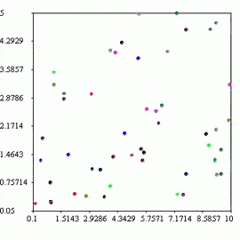
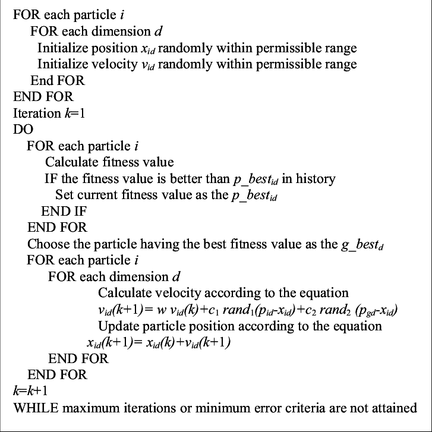

<h1 align="center">Particle Swarm Optimization</h1>


[](https://github.com/hasnainroopawalla/ShowML/actions/workflows/develop.yml)
[](https://opensource.org/licenses/MIT)

A Python package to find the optimal solution in a search space using Particle Swarm Optimization (a meta-heuristic optimization algorithm).

The Particle Swarm Optimization algorithm uses a swarm of candidate solutions (particles) to iteratively traverse the search space and find the best solution ([source](https://en.wikipedia.org/wiki/Particle_swarm_optimization)).


<p align="center">

</p>


## Algorithm

<p align="center">

</p>


## Usage
The [`pso.py`](https://github.com/hasnainroopawalla/particle-swarm-optimization/blob/c01bfec6881f48bd6ee70101d2cc0dc7288780d2/src/pso.py) file can be used to run the pso algorithm.
```
$ python pso.py
```

Let's minimize the following fitness function where the global minima (best solution) is $x=0$ and $y=0$.

$$z = x^2 + y^2 + 1$$

The `basic` (example) fitness function can be found in [`fitness_functions.py`]().
```python
def basic(position: np.ndarray) -> float:
    return position[0] ** 2 + position[1] ** 2 + 1
```

Initialize the desired search space and run the PSO algorithm with `max_iterations=25`.
```python
search_space = SearchSpace(fitness_function=basic, num_particles=30)
run_pso(search_space, max_iterations=25)
```

The output of the PSO algorithm for this example.
```python
iteration: 1, best solution: inf
iteration: 2, best solution: 283.85568439814904
iteration: 3, best solution: 5.203955832770901
iteration: 4, best solution: 5.203955832770901
iteration: 5, best solution: 3.747826449279776
iteration: 6, best solution: 2.8287578052400155
iteration: 7, best solution: 1.552319409418982
iteration: 8, best solution: 1.552319409418982
iteration: 9, best solution: 1.0189521367213712
iteration: 10, best solution: 1.0189521367213712
iteration: 11, best solution: 1.0189521367213712
iteration: 12, best solution: 1.0037135574106335
iteration: 13, best solution: 1.0037135574106335
iteration: 14, best solution: 1.0002412313859235
iteration: 15, best solution: 1.0002412313859235
iteration: 16, best solution: 1.0002412313859235
iteration: 17, best solution: 1.0002412313859235
iteration: 18, best solution: 1.0001922283647275
iteration: 19, best solution: 1.0001922283647275
iteration: 20, best solution: 1.0000706418639282
iteration: 21, best solution: 1.0000246260489807
iteration: 22, best solution: 1.0000246260489807
iteration: 23, best solution: 1.000000240219261
iteration: 24, best solution: 1.000000240219261
iteration: 25, best solution: 1.000000240219261

FINAL SOLUTION: [-0.00044665 -0.0002018 ], 1.000000240219261
```

## Contributing
- Post any issues and suggestions on the GitHub [issues](https://github.com/hasnainroopawalla/particle-swarm-optimization/issues) page.
- To contribute, fork the project and then create a pull request back to master.


## License
This project is licensed under the MIT License - see the [LICENSE](https://github.com/hasnainroopawalla/particle-swarm-optimization/blob/c01bfec6881f48bd6ee70101d2cc0dc7288780d2/LICENSE) file for details.
